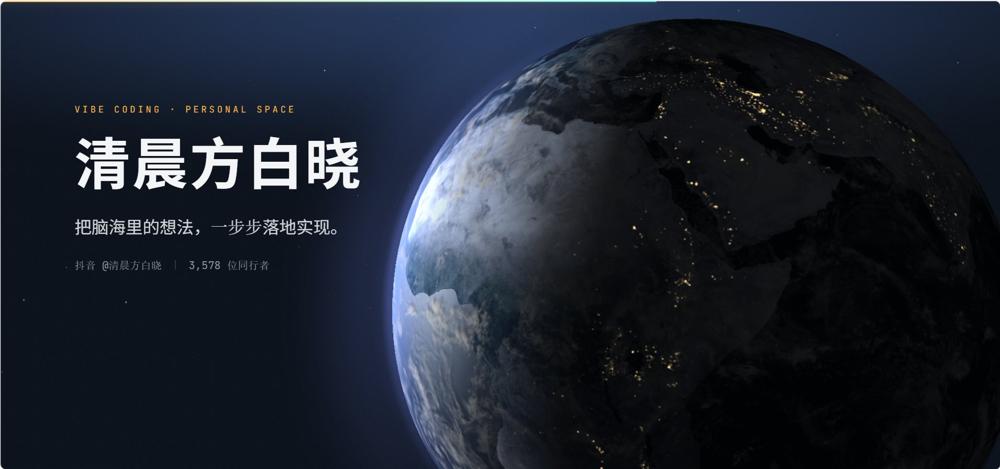

<p align="center">
  
</p>

<h1 align="center">星空地球 · baixiao-earth</h1>

<p align="center">
  个人主页模板：一颗地球，六个章节。<br>
  滚动时地球跟着换状态，横向拖动可以转它，右上角齿轮里还能把每章停留的秒数改成你喜欢的节奏。
</p>

---

## 它是什么

一个纯前端的个人主页。**地球是背景层，内容是浮在上面的一层。**

- 六个章节，分别对应地球的六种状态
- 滚动页面时，地球的状态、镜头、氛围色跟着变
- 「沉浸播放」：一键让六章自己往下走，适合录屏或现场展示
- 没有框架、没有 UI 库，构建只用 Vite

## 快速开始

```bash
git clone https://github.com/csuyincs-creator/baixiao-earth.git
cd baixiao-earth
npm install
npm run dev
```

然后打开 http://localhost:5173

```bash
npm run build     # 产物在 dist/，纯静态，扔哪都能跑
npm run preview   # 本地预览构建结果
```

## 页面

| 路径 | 内容 |
| --- | --- |
| `/` | 主页：六章内容 + 地球背景层 |
| `/articles.html` | 作品归档列表。轻量页，不加载地球，打开很快 |
| `/demo.html` | 原始地球演示：只跑地球，没有内容层 |
| `/gallery.html` | 六状态横版同屏对照，调参数时看着方便 |

## 六个章节

| # | 章节 | 地球状态 | 章节转场 |
| --- | --- | --- | --- |
| 1 | 开场 | 裸地球 | intro |
| 2 | 数字 | 云层 | dissolve |
| 3 | 作品 | 城市光点 | rail |
| 4 | 关于 | 轨道环绕 | lift |
| 5 | 开源 | 大气辉光 | bloom |
| 6 | 关注 | 全景 | pullback |

## 交互

**滚动**
内容和地球一起走。地球的朝向跟滚动无关 —— 往下滚不会把已经转好的角度带走。

**拖动**
空白处横向拖 → 转地球；纵向手势留给页面滚动，手机上也是这个分工。

**右上角齿轮 · 设置面板**

- **沉浸播放 · 每章停留** —— 逐章设置自动播放时停留几秒（1–24s，步进 0.1s），下面实时显示整轮总时长；也可以一键切「紧凑 / 标准 / 舒缓」三档预设。改过的值会存进 localStorage，下次打开还在。
- 地球 / 组件大小、亮度、自动旋转速度、拖拽灵敏度
- 光点与轨道：大小、亮度、显隐、三色自定义，外加 Neon / Ice / Sunset / Aurora 四套配色
- 底部「恢复默认」一键还原

**沉浸播放**
点右上角「沉浸播放」→ 黑幕落下 → 页面重开 → 六章按你设的时长自动往下播。
播放期间常驻 UI 全部收起，鼠标指针也藏起来，只留屏幕顶端一条 2px 进度线。
退出：`ESC` / 滚一下滚轮 / 触摸滑动 / 方向键·空格 / 双击。播完自动结束。

**章节进度轨**
右侧竖排六个点，点哪跳哪。

## 目录结构

```
.
├─ index.html                 主页
├─ articles.html              作品归档页
├─ src/
│  ├─ js/
│  │  ├─ main.js              入口：装配 Lenis 与各模块
│  │  ├─ home.js              章节判定 / 入场动效 / 作品区联动
│  │  ├─ immersive.js         沉浸播放（每章停留时长在这里消费）
│  │  ├─ earth-controls.js    状态控制条 + 设置面板
│  │  ├─ earth-link.js        章节 → 地球氛围映射
│  │  └─ articles.js          归档页逻辑
│  └─ styles/
│     ├─ fonts.css            自托管字体
│     ├─ earth-ui.css         地球层与原站 UI（含设置面板样式）
│     ├─ home.css             主页版式与色板
│     ├─ motion.css           动效四套：Enter / Reveal / Count / Interact
│     ├─ energy.css           按章节能量等级关能力
│     ├─ immersive.css        沉浸播放态
│     └─ articles.css         归档页
├─ public/
│  ├─ appv2.js                地球场景运行时（第三方产物，见「许可与来源」）
│  ├─ appv2.css
│  ├─ demo.html               原始地球演示
│  ├─ gallery.html            六状态对照
│  └─ assets/
│     ├─ fonts/               Inter / JetBrains Mono / Noto Sans SC / Noto Serif SC
│     ├─ textures/earth/      地球贴图（albedo + data）
│     └─ covers/              作品封面
└─ assets/readme/             README 用图
```

## 技术栈

- **地球**：three.js —— 内嵌在 `public/appv2.js`，一个独立打包产物，不经 Vite 处理
- **滚动**：Lenis（走真实滚动，不是 transform 伪造）
- **动效**：GSAP + 少量 WAAPI / CSS
- **构建**：Vite 7，零框架

内容层与地球层只通过 DOM 契约通信：地球层认 `[data-component]`，内容层改完参数后调 `window.__BAIXIAO_EARTH_APPLY__` 重绘。**两边不互相 import**，所以 `appv2.js` 可以整体替换成你自己做的场景。

## 字体

`public/assets/fonts/` 下 7 个 woff2 全部自托管，都是 SIL Open Font License 1.1：

- Inter（400 / 600 / 700）
- JetBrains Mono（400）
- Noto Sans SC（400 / 700，常用字子集）
- Noto Serif SC（400，常用字子集）

## 关于数据

主页「数字」章和归档页里的数字，来自我自己的抖音账号，按天手工同步。它们是**真实数据**，不是占位符 —— 你要拿去用的话，记得换成自己的。

## 许可

**GPL-2.0-or-later**，完整条款见 [LICENSE](./LICENSE)。

---

Made with Vibe Coding · 把想法一步步落地
